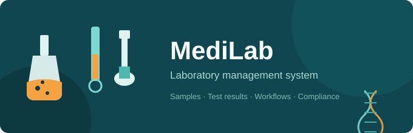

# Medilab



[](https://sonarcloud.io/summary/new_code?id=SoltuneMontepre_medilab2)

Laboratory Information Management System (LIMS) for testing laboratories, built on Odoo 19.0. Modules:

- [E-commerce](docs/functional/ecommerce_module/overview.md)
- [Laboratory](docs/functional/laboratory_module/overview.md)
- [Inventory](docs/functional/inventory_module/overview.md)

Documentation index: [docs/readme.md](docs/readme.md).

## Prerequisites

| Tool                                                     | Purpose                                            |
| -------------------------------------------------------- | -------------------------------------------------- |
| Docker or Podman                                         | Runs the container stack                           |
| [Task](https://taskfile.dev/installation/)               | `task` CLI for setup and daily commands            |
| [uv](https://docs.astral.sh/uv/)                         | Python environment for linting and typecheck       |
| [Doppler CLI](https://docs.doppler.com/docs/install-cli) | Secrets                                            |
| [Node.js](https://nodejs.org/en/download)                | `npx` for the `doppler` and `context7` MCP servers |

## Quick start

```powershell
task setup
```

`task setup` creates `src/core/.venv`, fetches the Odoo source, installs Serena, authenticates Doppler (paste a token or browser login, selecting project `medilab`, config `dev`) and starts the containers.

Open http://localhost:8069 and create the `medilab` database. Modules are installed with `task upgrade MODULES=<module>`, for example `task upgrade MODULES=laboratory`.

`task upgrade MODULES=laboratory,demo` adds demo data and a `demo.<role>` user per role; their password is `MEDILAB_DEMO_PASSWORD` at install, or the login when it is unset.

## Services

| Service     | URL                   | Notes                                 |
| ----------- | --------------------- | ------------------------------------- |
| Odoo        | http://localhost:8069 |                                       |
| Postgres    | `localhost:15432`     | see [Environment](#environment)       |
| CloudBeaver | http://localhost:8978 | `medilab` / `admin` unless overridden |

## Commands

| Command                    | Purpose                                                                                                  |
| -------------------------- | -------------------------------------------------------------------------------------------------------- |
| `task`                     | List all tasks                                                                                           |
| `task setup`               | Run `doppler`, `dev:setup`, `ai:setup` and `upgrade`                                                     |
| `task up`                  | Start Odoo, Postgres and CloudBeaver                                                                     |
| `task doppler`             | Log the Doppler CLI in and select project `medilab`, config `dev`                                        |
| `task stop`                | Stop the containers and keep the volumes                                                                 |
| `task restart`             | Restart Odoo after changing Python, XML or config                                                        |
| `task logs`                | Follow the Odoo log                                                                                      |
| `task upgrade`             | Upgrade all installed modules                                                                            |
| `task upgrade MODULES=a,b` | Install and upgrade the listed modules                                                                   |
| `task reset`               | Delete the database and volumes, then start again                                                        |
| `task dev:setup`           | Sync `src/core/.venv` from `uv.lock` and fetch the Odoo source for type checks                           |
| `task ai:setup`            | Check `npx` for the MCP servers and install Serena for the Claude Code hooks and the `serena` MCP server |
| `task dev:lock`            | Re-resolve `uv.lock` after editing dependencies in `pyproject.toml`                                      |
| `task lint`                | Run ruff and pylint-odoo on `src/core/modules`                                                           |
| `task format`              | Format `src/core/modules` with ruff                                                                      |
| `task typecheck`           | Type check the addons with pyright                                                                       |

Every task loads `src/core/.env.local`. To run a tool outside Task: `uv run --project src/core --env-file src/core/.env.local <command>`.

## Layout

```text
medilab/
  taskfile.yml                  # entrypoint
  docs/                         # documentation
  src/
    core/                       # the Odoo app
      config/odoo.conf          # mounted as /etc/odoo
      modules/                  # Odoo addons, mounted as /mnt/extra-addons
      modules.txt               # module list
      pyproject.toml            # Python dependencies and Ruff config
      uv.lock
      .env.local                # local credentials
    applications/               # other applications
      medilab-mobile/
      medilab-sync/
  tools/
    dockerfiles/                # prod.dockerfile
    infrastructure/             # docker-compose.yml and CloudBeaver config
    taskfiles/                  # app.taskfile.yml, dev.taskfile.yml
  .github/                      # CI workflow and odoo-lint action
```
