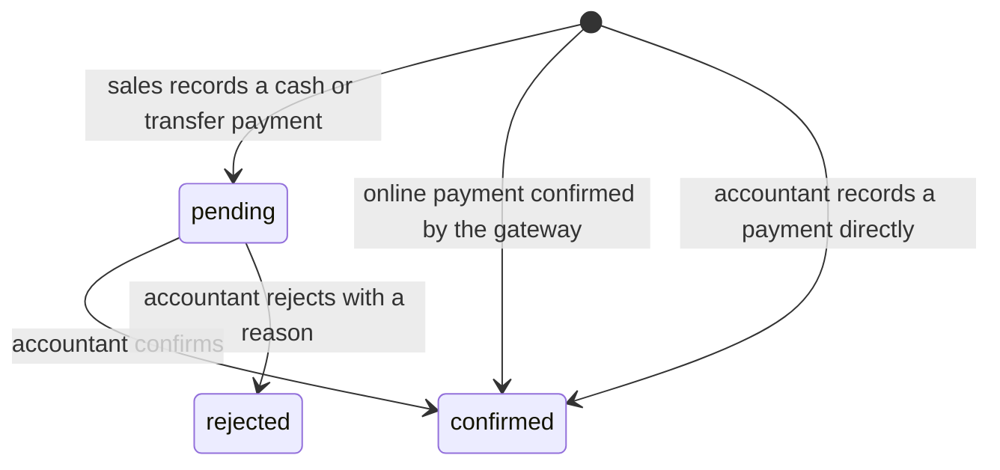

# Features of: Accountant

The accountant is the laboratory's financial user. The accountant issues and tracks invoices, confirms every payment, and reports on revenue and cash flow. The accountant does not set prices, quotations or approvals.

## I. User Stories

### Invoices

- **US-A01** As an accountant, I want to see every invoice, filtered by customer, status and date, so that I know what has been billed.
- **US-A02** As an accountant, I want to create the final invoice for an order, so that the customer is billed for the work done beyond the advance.
- **US-A03** As an accountant, I want advance invoices to be created and posted automatically when sales sends a quotation, so that I do not create them by hand.
- **US-A04** As an accountant, I want to send an invoice by email and download it as PDF, so that I can give the customer a document in the format they need.
- **US-A05** As an accountant, I want tax to be calculated according to the applicable rules, so that invoices comply with local regulations.

### Payments

- **US-A06** As an accountant, I want online payments to be recorded and matched to the invoice automatically, so that I do not enter them again.
- **US-A07** As an accountant, I want to record cash and bank-transfer payments against an invoice, so that the invoice shows the correct status.
- **US-A08** As an accountant, I want to confirm or reject the payments that sales recorded from customers, so that only verified money counts as paid.
- **US-A09** As an accountant, I want partial payments to be supported, so that a customer can pay an invoice in instalments.
- **US-A10** As an accountant, I want a payment receipt to be issued for every payment, so that the customer has proof of payment.
- **US-A11** As an accountant, I want to see the payment status of every order (not paid, partially paid, paid), so that I can follow up on what is owed.
- **US-A12** As an accountant, I want the system to remind customers of overdue payments, so that I do not chase them one by one.
- **US-A13** As an accountant, I want to reconcile each day's PayOS transactions with the payments in the system and lock the day once it matches, so that no online payment is missing or changed afterwards.

### Reports and KPIs

- **US-A14** As an accountant, I want revenue, outstanding amounts and cash-flow reports for a period, so that I can manage the laboratory's finances.
- **US-A15** As an accountant, I want to export reports to a spreadsheet, so that I can use them in the laboratory's accounting records.
- **US-A16** As an accountant, I want to see how long payments take after an invoice is sent, so that I can measure collection performance.

## II. Feature Details

### 1. Invoices (US-A01 to US-A05)

| Invoice                                 | Created by                                                   | Purpose                                                                                  |
| --------------------------------------- | ------------------------------------------------------------ | ---------------------------------------------------------------------------------------- |
| Advance invoice                         | System, when sales sends a quotation with an advance request | Collect the amount (full, percentage or fixed) the customer pays to accept the quotation |
| Final invoice                           | Accountant, from the confirmed order                         | Bill the remaining amount once the work is done                                          |
| Adjustment invoice (hóa đơn điều chỉnh) | Accountant, from a posted invoice                            | Correct a posted invoice with only the difference, raising or lowering the amount        |

- An advance invoice is posted automatically; the accountant does not need to create or post it.
- The final invoice deducts the advance already paid, so the customer is never billed twice for the same parameters.
- Invoices are sent by email with the PDF attached, and can be downloaded at any time. Customers see their posted invoices on the portal.
- Tax follows the tax of each quotation line: the parameter's or package's tax, or the one sales set on the quotation. Prices in the catalog exclude VAT; the invoice shows net, tax and total separately.
- A posted invoice cannot be edited. The accountant corrects it with an adjustment invoice that holds only the difference, as positive or negative lines. It is posted, emailed and shown on the portal like any other invoice, and the amount owed on the corrected invoice includes its adjustments.

Acceptance criteria:

- Sending a quotation with an advance request creates one posted advance invoice.
- The final invoice total equals the order total minus the advance.
- An adjustment invoice of −500,000 VND on a 5,000,000 VND invoice leaves 4,500,000 VND owed, and the original invoice is unchanged.
- A posted invoice cannot be edited; only an adjustment invoice changes what is owed.
- An invoice shows net, tax and total, and can be downloaded as PDF.

### 2. Payments (US-A06 to US-A13)

| Source                                            | How it is recorded                                                                                                                                                                                                                                        |
| ------------------------------------------------- | --------------------------------------------------------------------------------------------------------------------------------------------------------------------------------------------------------------------------------------------------------- |
| Online payment                                    | The gateway confirms the payment with a signed notification; the system records it and matches it to the invoice. Returning to the website without that confirmation does not count as payment. A repeated notification does not create a second payment. |
| Cash or bank transfer, recorded by the accountant | The accountant selects the invoice, amount, date and method.                                                                                                                                                                                              |
| Cash or bank transfer, recorded by sales          | Sales creates a pending record; it counts only after the accountant confirms it.                                                                                                                                                                          |

Rules:

- **Partial payments.** A payment can be less than the amount due; the invoice is then partially paid and the remaining amount stays open. A payment cannot exceed the remaining amount.
- **Payment status.** Every order shows not paid, partially paid or paid, calculated from the confirmed payments on its posted invoices.
- **Receipts.** A receipt is issued for each confirmed payment and is available to the customer.
- **Pending amounts.** The accountant sees the pending amount per order so that a payment recorded by sales is not entered a second time.
- **Overdue reminders.** When an invoice passes its due date unpaid, the customer is reminded by their chosen notification channel at a fixed interval until it is paid; the accountant sees the list of overdue invoices.
- **Credit customers.** For a customer allowed to order on credit, an order can proceed without payment; the invoice then follows the normal due-date and reminder rules.

Acceptance criteria:

- A payment recorded by sales does not change the payment status until the accountant confirms it.
- A rejected payment returns the invoice to its previous status and notifies the salesperson with the reason.
- A repeated gateway notification for the same payment is ignored.
- A payment larger than the remaining amount is refused.

#### Reconciliation (US-A13)

The accountant reconciles each day's PayOS transactions with the payments in the system.

| Rule     | Description                                                                                                                                                                                               |
| -------- | --------------------------------------------------------------------------------------------------------------------------------------------------------------------------------------------------------- |
| Day view | For a chosen day, every PayOS transaction is listed with its PayOS reference, amount, invoice, the matching payment and whether they match.                                                               |
| Mismatch | A transaction PayOS reports as paid with no payment in the system, or a payment with no PayOS transaction, is flagged. The accountant creates the missing payment from a flagged transaction in one step. |
| Lock     | Once a day is reconciled, the accountant locks it, and its online payments can no longer be changed.                                                                                                      |

Acceptance criteria:

- A PayOS transaction paid with no payment in the system is flagged as a mismatch.
- Creating the payment from a flagged transaction confirms it against the right invoice and clears the flag.
- An online payment of a locked day cannot be changed.

### 3. Reports and KPIs (US-A14 to US-A16)

| Report                 | Content                                                                 |
| ---------------------- | ----------------------------------------------------------------------- |
| Revenue                | Invoiced and collected amounts per period, customer and main parameter group. A group's revenue is the revenue of its parameters; a package line's amount is spread over its parameters in proportion to their own prices times quantities. |
| Outstanding            | Unpaid and overdue invoices, with age of the debt                       |
| Cash flow              | Money received per period, per payment method                           |
| Collection performance | Time from invoice sent to payment, share of invoices paid on time       |

- Reports can be filtered by period and customer and exported to a spreadsheet.
- Reports use confirmed payments only; pending records are shown separately.

## IV. Related documents

- [E-commerce module overview](../overview.md)
- [Sales features](sales.md)
- [Customer features](customer.md)
