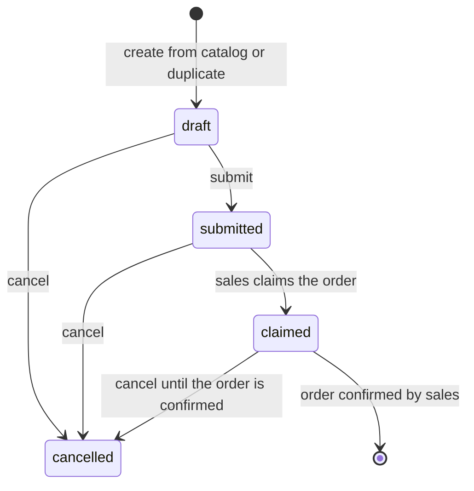
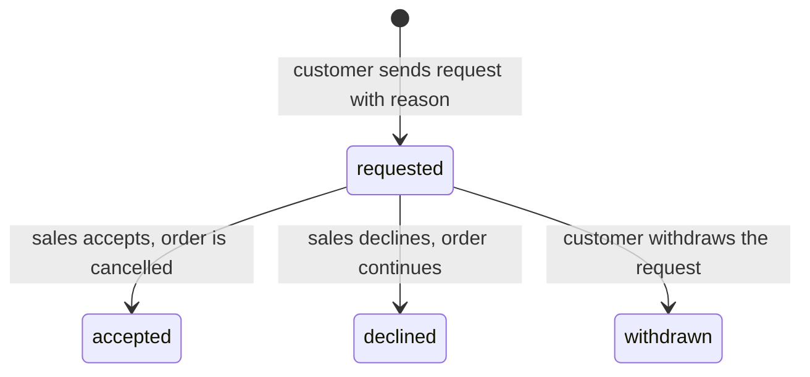

# Features of: Customer

The customer is an external user of the laboratory. A customer has an account linked to a customer profile. Everything the customer sees is limited to the documents of their own organisation or person. The customer works through the customer portal only.

## I. User Stories

### Account

- **US-C01** As a customer, I want to create an account and log in to the customer portal so that I can access my account information and place orders.
- **US-C02** As a customer, I want to view my account information, including my contact details and order history, so that I can keep track of my interactions with the laboratory.
- **US-C03** As a customer, I want to update my profile and contact information, so that the laboratory always has my current details.
- **US-C04** As a customer, I want to reset my password myself when I forget it, so that I can regain access without contacting the laboratory.
- **US-C05** As a business customer, I want to add the people of my company as contacts and choose who the laboratory should contact, so that sales reaches the right person for each order.
- **US-C06** As a customer, I want to upload and remove my logo, so that my documents and portal show my identity.
- **US-C07** As a customer, I want to configure my notification preferences, choosing which updates I receive and where I receive them, so that I am informed the way I prefer.

### Ordering

- **US-C08** As a customer, I want to place orders for laboratory tests through the customer portal, so that I can easily request the tests I need.
- **US-C09** As a customer, I want to save an order as a draft and submit it when it is complete, so that I can prepare it over time without the laboratory seeing an unfinished request.
- **US-C10** As a customer, I want to reorder a past order with one click, so that I can repeat a test I have ordered before without selecting the parameters again.
- **US-C11** As a customer, I want to cancel an order until the laboratory has confirmed it, so that I can correct a mistake.
- **US-C12** As a customer, I want to request the cancellation of an order that the laboratory has already confirmed, so that I can withdraw it when my needs change, and be told whether the laboratory accepted.

### Quotation and payment

- **US-C13** As a customer, I want to view the quotation the laboratory sends me, including parameters and prices, so that I know exactly what I will pay for.
- **US-C14** As a customer, I want to accept a quotation by paying the advance invoice online or by bank transfer or cash, so that the order moves forward without a separate signing step.
- **US-C15** As a customer, I want to decline a quotation and give a reason, so that the laboratory knows why I did not proceed.
- **US-C16** As a customer, I want to view and download invoices for my orders, so that I can keep track of my payments and expenses.
- **US-C17** As a customer, I want to pay an invoice online, in full or in part, so that I can settle my account conveniently.

### Tracking and results

- **US-C18** As a customer, I want to track the status of my orders and receive notifications when they are ready for collection, so that I can stay informed about the progress of my tests.
- **US-C19** As a customer, I want to download my test results from the customer portal, so that I can access my results conveniently and securely.

### Support

- **US-C20** As a customer, I want to contact the laboratory's customer support team through the customer portal, so that I can get help with any issues or questions I may have.
- **US-C21** As a customer, I want to provide feedback on my experience with the laboratory, so that I can help improve the quality of service provided.

## II. Feature Details

### 1. Account and profile (US-C01 to US-C07)

- A customer can **self-register** or be **invited** by sales. Self-registration creates an account and a new customer profile; a business is identified by tax code and an individual by citizen ID plus tax code.
- Self-registration asks for the name, address, phone and email, and the tax code of a business or the citizen ID and tax code of an individual. Registration with any of them missing is refused.
- If the identity matches an existing profile, the account is flagged for sales to review instead of being merged automatically.
- The account page shows contact details, tax and identity information, and additional addresses.
- Order history is a single list of every quotation and order of the customer, with a customer-facing status.

#### Password reset (US-C04)

- A customer who forgot their password requests a reset link on the login page. The link is emailed to the address on the account, is single-use and expires after a short time.
- A logged-in customer can also change their password from the account settings by entering the current one.
- The reset page gives the same response whether or not the email exists, so it cannot be used to find out who has an account.

#### Company contacts (US-C05)

A business customer can register the people of their company as **contacts** on their profile. A person has a name, position, email and phone, and can be marked as the default.

- When sales or the system needs to reach the customer for an order (quotation, payment, results), the contact is chosen from a dropdown of the company's contacts. The customer can preselect the contact when ordering; sales can change it.
- Each order stores the contact chosen, so later changes to the contact list do not rewrite history.
- A contact is a person to be reached, not a portal user. Whether a contact can also log in is not part of this feature.
- Individual customers do not have contacts; they are the contact.

#### Logo (US-C06)

- The customer uploads a logo image from the account page and can remove it again. Accepted formats are image files up to a size limit, shown before upload.
- The logo appears on the portal and on documents addressed to the customer, such as the quotation and the result report. After removal, documents show the customer name only.
- Replacing the logo does not alter documents already issued.

#### Notification preferences (US-C07)

The customer decides **what** they are told about and **where**.

| Choice        | Options                                                                                                               |
| ------------- | --------------------------------------------------------------------------------------------------------------------- |
| What          | Per event type: order updates (submitted, claimed, cancelled), quotation sent, invoice and payment, results released. |
| Where         | Per event type: email, SMS, in-portal notification. Each event can use one or several channels.                       |
| Which contact | For a business, the contact who receives the notification (see Company contacts).                                     |

Rules:

- Every event has a sensible default so a new customer is notified without configuring anything.
- Notifications the customer must receive, such as password reset and payment receipts, cannot be turned off.
- Preferences apply to future notifications only.

Acceptance criteria:

- A newly registered user can log in and sees only their own documents.
- Registering without a required field is refused.
- A customer cannot open another customer's quotation, invoice or result; access is denied.
- A customer can update their contact information, and the changes are saved.
- A customer can reset their password without help from the laboratory, and an old reset link stops working after use.
- A business customer can add, edit and remove contacts, and pick one as the contact of an order from a dropdown.
- A customer can upload a logo, see it on their documents, and remove it.
- A customer can choose which events they are notified about and through which channel, and a changed preference applies to the next notification.
- Identity fields already submitted are not asked again.

### 2. Placing an order (US-C08 to US-C12)

The customer builds an order from the test catalog, like a cart. The unit of selection is the **parameter** (test) or a **service package**: the customer searches the catalog and adds the parameters or packages they need to the cart. Sample types and other catalog categories are **filters** that narrow the catalog, not things the customer has to pick first. The total price is shown while composing.

Catalog filters:

- Sample type
- Parameter group
- Free-text search on the parameter name
- Price range
- AI suggested based on the customer's description of the sample and the parameters they have already selected

Parameters are grouped by kind of analysis. The catalog shows the group and its parameters, for example:

| Parameter group                                       | Example parameters                                   |
| ----------------------------------------------------- | ---------------------------------------------------- |
| Microbiology                                          | TPC, Coliforms, E. coli, Salmonella, yeast and mould |
| Physico-chemical and nutrition                        | Protein, fat, sugar, moisture, energy                |
| Heavy metals                                          | Lead (Pb), Cadmium (Cd), Arsenic (As), Mercury (Hg)  |
| Additives, preservatives, colorants                   | Benzoate, sorbate, synthetic colorants               |
| Mycotoxins                                            | Aflatoxin, Ochratoxin A                              |
| Residues of pesticides, veterinary drugs, antibiotics | Active-substance groups, by method                   |

#### Pricing

- **Price per parameter.** Every parameter has its own specific price in the catalog; the group only organises the catalog and does not set a price.
- **Total = sum of the selected parameters' and packages' prices.** A package line uses the package price, not the sum of its parameters. For a parameter ordered in a quantity, the price is multiplied by the quantity. The cart shows each parameter's price and a running total as parameters are added or removed.
- **Prices exclude VAT.** Tax is added on the quotation and the invoice, not in the cart.
- **The cart total matches the quotation.** The prices come from the catalog, so the quotation uses the same prices unless sales adjusts them (for example a discount) before sending.

| Rule                  | Description                                                                                                                            |
| --------------------- | -------------------------------------------------------------------------------------------------------------------------------------- |
| Public catalog        | Anyone can browse the catalog and fill a cart without signing in.                                                                      |
| Details on submit     | A visitor who is not signed in gives their details and e-mail address when submitting; they become the customer's contact.            |
| Complete order        | Submitting requires at least one parameter or service package in the cart.                                                             |
| Submit is not confirm | Submitting only puts the order in the sales queue. Sales then prepares the quotation.                                                  |
| Cancel                | The customer can cancel until the order is confirmed; after that the customer can only [request cancellation](#request-cancel-us-c12). |
| Reorder               | See [Reorder](#reorder-us-c10).                                                                                                        |

#### Reorder (US-C10)

The customer opens a past order in the order history and chooses **Reorder**. The system creates a new draft order with the same parameters, packages and quantities. The customer can edit the draft (add or remove parameters and packages, change quantities) and then submit it like any new order.

| Rule                         | Description                                                                                                                                                                                        |
| ---------------------------- | -------------------------------------------------------------------------------------------------------------------------------------------------------------------------------------------------- |
| Source                       | Any order of the customer's own partner; it does not have to be completed.                                                                                                                         |
| New draft                    | The result is always a new draft, never submitted automatically. The original order does not change.                                                                                               |
| Current prices               | Prices come from the current catalog, not from the original quotation, so the total can differ. Parameters and packages that are no longer in the catalog are not copied and the customer is told which ones. |
| No payment or results copied | Invoices, payments, approvals, sample data and results stay with the original order.                                                                                                               |
| Ownership                    | The new draft belongs to the customer and is not assigned to a salesperson until sales claims it after submission.                                                                                 |

Acceptance criteria:

- A visitor who is not signed in can browse the catalog and fill a cart.
- Submitting without being signed in asks for the visitor's details and e-mail address, and is refused without an e-mail address.
- Reordering a completed order creates a draft with the same parameters and packages at current prices.
- The original order, its invoices and its results are unchanged.

#### Request cancel (US-C12)

After the order is confirmed the customer can no longer cancel it directly, because the laboratory may already have collected samples or started testing. Instead the customer sends a **cancellation request** with a reason, and sales decides.

| Rule                          | Description                                                                                                                                                                                                                              |
| ----------------------------- | ---------------------------------------------------------------------------------------------------------------------------------------------------------------------------------------------------------------------------------------- |
| When                          | Only on a confirmed order that is not yet completed. Before confirmation the customer cancels directly.                                                                                                                                  |
| Reason required               | The request needs a reason. The salesperson receives a to-do and the reason is kept in the order's history.                                                                                                                              |
| One open request              | An order can have only one open request. The customer can withdraw it while it is undecided.                                                                                                                                             |
| Sales decides                 | Sales accepts or declines, and a declined request carries a reply to the customer. Accepting cancels the order and everything the laboratory created for it.                                                                             |
| Blocked cases                 | Cancellation cannot be accepted when any of its testing is already completed or its results have been released, or when the order is fully signed, in which case sales raises a change request instead. The customer is told that the laboratory will contact them. |
| Order keeps running meanwhile | A pending request does not pause the laboratory; testing continues until sales accepts.                                                                                                                                                  |
| Money                         | There is no refund flow. If an advance was paid, the money stays on the invoice and sales settles it with the customer outside the system. The customer is told this when sending the request.                                           |
| Notification                  | The customer gets an email when the request is accepted or declined.                                                                                                                                                                     |

Acceptance criteria:

- A confirmed order shows **Request cancellation** instead of **Cancel**; an unconfirmed one shows **Cancel**.
- Sending a request without a reason is refused.
- Accepting cancels the order and everything under it, and the customer's status becomes Cancelled.
- Declining leaves the order unchanged and shows the reply on the order page.

### 3. Quotation, acceptance and payment (US-C13 to US-C17)

- The quotation page shows the parameters, prices, the payment deadline and the advance invoice.
- **Acceptance is payment.**. Paying the advance invoice means the customer accepted.
- The customer can decline a sent quotation with a reason; the salesperson is notified and the order is not cancelled.
- When sales creates a new revision of a quotation, the customer sees a banner and the list of revisions.
- The invoice list shows posted invoices only, with payment status and the amount still owed. The customer can print or download the invoice and, after payment, the payment receipt.
- Online payment accepts any amount up to the remaining balance, so partial payments are possible.

### 4. Tracking and results (US-C18, US-C19)

The portal maps the internal states to four customer-facing labels:

| Label     | Meaning                                 |
| --------- | --------------------------------------- |
| Waiting   | Order confirmed, testing not started    |
| Testing   | The laboratory is analysing the samples |
| Completed | All samples completed                   |
| Cancelled | Order cancelled                         |

Results are available for download only after the laboratory has released them (testing is completed and the results are approved). The customer gets the latest version of the result document.

### 5. Notifications (US-C07, US-C18)

The customer receives one notification per event, through the channels chosen in the [notification preferences](#notification-preferences-us-c07) (email by default):

| Event                                    | Notification                                |
| ---------------------------------------- | ------------------------------------------- |
| Account created or portal access granted | Account and password setup                  |
| Order submitted                          | Submission confirmation                     |
| Order claimed by sales                   | Claimed notice                              |
| Order cancelled                          | Cancellation notice                         |
| Quotation sent                           | Quotation with payment instructions or link |
| Invoice posted                           | Invoice                                     |
| Payment received                         | Payment receipt                             |
| Results released                         | Results ready                               |

### 6. Support and feedback (US-C20, US-C21)

- **Support.** The customer opens a support request from the portal, optionally linked to an order, and follows the conversation with sales until it is closed.
- **Feedback.** After an order is completed the customer can rate the service and leave a comment. Feedback is visible to sales and management and is not shown to other customers.

| Rule         | Description                                                                                                                  |
| ------------ | ---------------------------------------------------------------------------------------------------------------------------- |
| Request      | A support request has a subject and can be linked to one of the customer's orders. Files can be attached to its messages.     |
| Status       | A request is open, answered once support has replied and the customer has not written since, or closed. Writing on an answered request opens it again. |
| One feedback | An order has at most one feedback: a rating from 1 to 5 and an optional comment, given once the order is completed.          |

Acceptance criteria:

- A support request linked to an order shows on that order for the customer and for sales.
- A reply from support sets the request to answered and notifies the customer.
- Feedback can be given only on a completed order, once.
- Another customer never sees a customer's feedback.

## IV. Related documents

- [E-commerce module overview](../overview.md)
