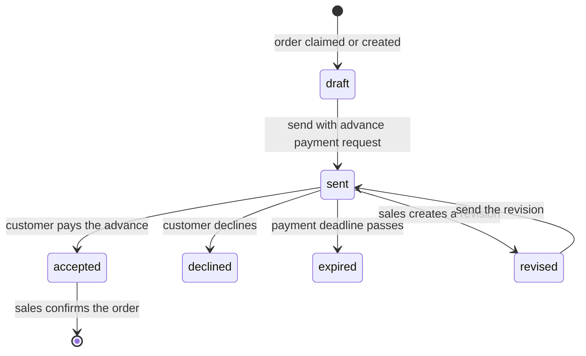
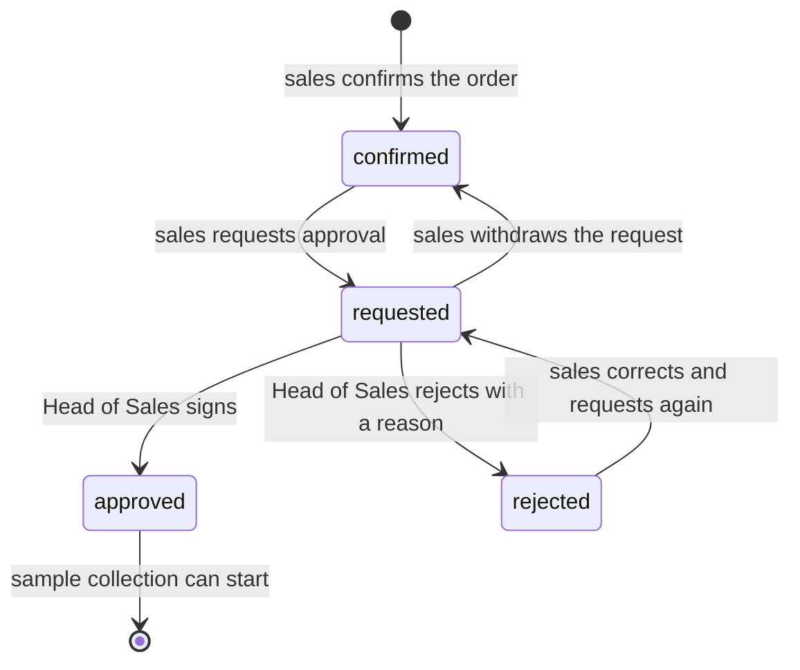

# Features of: Sales

Sales is the laboratory's salesperson. Sales turns customer orders into quotations, collects the advance payment, confirms the order and gets it approved so the laboratory can collect samples. Sales owns the relationship with the customer: profiles, contacts and follow-up.

## I. User Stories

### Orders and customers

- **US-S01** As a salesperson, I want to see the orders customers have submitted and claim one, so that every order has a single owner and nothing waits unnoticed.
- **US-S02** As a salesperson, I want to create an order on behalf of a customer who contacted me by phone or in person, so that every sale goes through the same flow.
- **US-S03** As a salesperson, I want to view and manage customer profiles and their contact people, so that I know who to reach for each order.
- **US-S04** As a salesperson, I want to invite a customer to the portal and review accounts flagged as possible duplicates, so that each customer has exactly one profile.

### Quotation

- **US-S05** As a salesperson, I want to prepare a quotation from an order, checking the selected parameters and adding or removing them, so that the quotation matches what the customer needs.
- **US-S06** As a salesperson, I want to adjust prices with a discount before sending, so that I can offer the customer an agreed price.
- **US-S07** As a salesperson, I want to send the quotation together with the advance payment request, so that the customer can accept by paying.
- **US-S08** As a salesperson, I want to revise a quotation that has been sent, so that I can correct it without losing the earlier version.
- **US-S09** As a salesperson, I want to save a quotation as a template and create new quotations from it, so that I do not re-enter common packages of parameters.
- **US-S10** As a salesperson, I want to see whether the customer has paid, declined or let the quotation expire, so that I know when to follow up.

### Payment collection

- **US-S11** As a salesperson, I want to record a cash or bank-transfer payment received from a customer, so that the accountant can confirm it without asking the customer again.

### Confirmation and approval

- **US-S12** As a salesperson, I want to confirm an order once the customer has accepted, so that it becomes a sale order the laboratory can work on.
- **US-S13** As a salesperson, I want to request approval of a confirmed order from the Head of Sales, and withdraw the request if I need to change something, so that the order is checked before samples are collected.
- **US-S14** As a salesperson, I want to be told when the order is approved or rejected and why, so that I can proceed or fix it.
- **US-S15** As a salesperson, I want to start sample collection only for approved orders, so that the laboratory never works on an unapproved order.

### Cancellation

- **US-S16** As a salesperson, I want to review the cancellation requests of my customers and accept or decline them with a reply, so that cancellations are handled consistently.
- **US-S17** As a salesperson, I want to cancel an order myself while the laboratory has not completed any testing, so that I can handle cancellations the customer asks for by other channels.

### Follow-up and analytics

- **US-S18** As a salesperson, I want to track the progress of my orders through testing and result release, so that I can answer customers' questions.
- **US-S19** As a salesperson, I want to see my pipeline and my performance, so that I can plan my work and see my results.

## II. Feature Details

### 1. Orders and customers (US-S01 to US-S04)

- **Queue.** Submitted customer orders appear in an unclaimed queue, oldest first. A salesperson claims one; from then on only that salesperson (and the Head of Sales) sees and edits it. A claimed order is not visible to other salespeople.
- **Order on behalf of a customer.** Sales selects the customer, adds parameters in the same catalog the customer uses and saves it as an order owned by the salesperson. From here the flow is the same as a portal order.
- **Customer profile.** Name, tax code or citizen ID, addresses, the contact people of a business, and the customer's order history. Sales can set whether a customer is allowed to order on credit (see below).
- **Portal invitation and duplicates.** Sales can invite a customer to the portal. A self-registered account that matches an existing profile is flagged; sales reviews it and merges the two so that the history stays on one profile.

Acceptance criteria:

- A claimed order cannot be claimed by another salesperson.
- A salesperson sees only the orders they own and the unclaimed queue; the Head of Sales sees all.
- Merging two profiles keeps every order and document on the remaining profile.

### 2. Quotation (US-S05 to US-S10)

| Rule             | Description                                                                                                                                                                                       |
| ---------------- | ------------------------------------------------------------------------------------------------------------------------------------------------------------------------------------------------- |
| Parameters       | A quotation needs at least one parameter. Sales may add or remove parameters; the customer sees the change on the quotation.                                                                      |
| Prices           | Prices come from the catalog per parameter. Sales may apply a discount (percentage or fixed) to a parameter or to the whole quotation. Tax is added by the system.                                |
| Advance payment  | When sending, sales chooses the collection method (online, bank transfer, cash) and the amount (full, percentage, fixed). The system creates the advance invoice and sends it with the quotation. |
| Manager shortcut | The Head of Sales can send without an advance payment, for customers with an agreement.                                                                                                           |
| Payment deadline | Default 3 days from sending, configurable by the administrator. Sales can set another date. An expired quotation is flagged, not cancelled; sales can extend it.                                  |
| Revisions        | A revision copies the quotation into a new draft linked to the one it replaces. The old version becomes read-only and the customer sees the revision list.                                        |
| Templates        | A quotation can be saved as a template (named set of parameters). Templates are never sent or confirmed.                                                                                          |
| Acceptance       | There is no customer signature. Payment of the advance invoice means acceptance. A declined quotation carries the customer's reason and notifies sales.                                           |

Acceptance criteria:

- A quotation without parameters cannot be sent.
- Sending a quotation with an advance request creates exactly one advance invoice and one notification to the customer.
- A revised quotation cannot be sent or confirmed in its old version.
- Sales sees at a glance whether a sent quotation is unpaid, paid, declined or expired.

### 3. Payment collection (US-S11)

When a customer pays sales directly in cash or by bank transfer, sales records the amount, date and method on the order. The record is **pending**: it does not count as paid until the accountant confirms it (see [accountant](accountant.md)). The order shows the pending amount so the same payment is not recorded twice, and the amount cannot exceed what the customer still owes.

### 4. Confirmation and approval (US-S12 to US-S15)

| Rule           | Description                                                                                                                                                                                                                                                                                                                                            |
| -------------- | ------------------------------------------------------------------------------------------------------------------------------------------------------------------------------------------------------------------------------------------------------------------------------------------------------------------------------------------------------ |
| Confirm        | Confirming does not wait for approval or payment. An order with no payment shows a warning, because the customer may have an agreement.                                                                                                                                                                                                                |
| Credit gate    | The laboratory core cannot confirm the test request of an order that has no payment unless the customer is marked as allowed to order on credit. Only the Head of Sales sets that flag.                                                                                                                                                                |
| Approval       | Two levels: the salesperson requests, the Head of Sales signs or rejects. Approval can only be requested on a confirmed order.                                                                                                                                                                                                                         |
| Separation     | The person who requested approval cannot also approve the same order.                                                                                                                                                                                                                                                                                  |
| Frozen content | Requesting approval is the salesperson's signature, so from the request on, customer, prices, validity date and parameters cannot be changed. To edit before the Head of Sales has signed, sales withdraws their signature first. After the Head of Sales has signed, a [change request](../../shared.md#sh-07-signed-documents-are-locked) is needed. |
| Collection     | **Start sample collection** is available only when the order is approved.                                                                                                                                                                                                                                                                              |
| Cancel guard   | An approved (fully signed) order cannot be cancelled directly; cancelling it goes through a change request that the Head of Sales approves.                                                                                                                                                                                                            |

Acceptance criteria:

- Content of an order under approval cannot be edited.
- Sales is notified, with the reason, when an order is rejected.
- Sample collection cannot start on an order that is not approved.

### 5. Cancellation (US-S16, US-S17)

- A customer's [cancellation request](customer.md#request-cancel-us-c12) reaches the owning salesperson as a task with the customer's reason.
- Sales accepts or declines and writes a reply to the customer. Accepting cancels the order and everything the laboratory created for it.
- Cancellation is blocked once any testing is completed or its results are released, or while the approval is still signed.
- If an advance was paid, cancelling does not return the money automatically; see the open questions.

### 6. Follow-up and analytics (US-S18, US-S19)

- **Progress.** Each order shows the same four labels the customer sees (Waiting, Testing, Completed, Cancelled) plus the detail for internal use.
- **Pipeline.** Counts by stage: unclaimed, draft, sent and unpaid, accepted, awaiting approval, approved.
- **Performance.** Per salesperson and period: quotations sent, accepted, declined, revenue, and the time between each step (claim, send, payment, approval).
- **Visibility.** A salesperson sees their own figures; the Head of Sales sees everyone's.

## III. Open questions

- **Refunds.** If a customer paid an advance and the order is cancelled, who refunds and how is it recorded? Until decided, the money stays on the invoice and is settled outside the system.
- **Samples in a parameter-first order.** Who groups the selected parameters into physical samples (see the [customer](customer.md#iii-open-questions) document)? Sales would be the natural owner at quotation time.

## IV. Related documents

- [E-commerce module overview](../overview.md)
- [Customer features](customer.md)
- [Accountant features](accountant.md)
