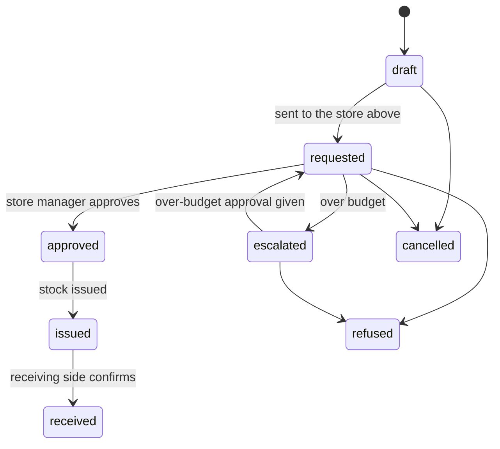

# Features of: Storekeeper

The storekeeper (thủ kho) manages the central store: items, locations and suppliers, purchase orders, receipts, the requisitions and transfers of the stores below it, stock takes, the disposal of expired stock and the accounting export. A person who manages a department store has the requisition, transfer and stock take features for that store.

## I. User stories

### Catalog

- **US-SK01** As a storekeeper, I want to maintain stock items with their unit, tracking, minimum quantity and shelf life after opening, so that stock is counted and checked the same way every time.
- **US-SK02** As a storekeeper, I want to maintain the tree of stock locations inside each store with their storage conditions, so that everyone knows where stock is and how it is kept.
- **US-SK03** As a storekeeper, I want to maintain suppliers with the items they sell, their references and last prices, so that I know where to buy each item.

### Buying

- **US-SK04** As a storekeeper, I want to create a purchase order for a supplier and send it for approval, so that stock is bought only once it is approved.
- **US-SK05** As a storekeeper, I want to send an approved purchase order to the supplier, so that the goods are on their way.
- **US-SK06** As a storekeeper, I want to receive goods against a purchase order, or without one, with their lot, expiry, quantity, price and certificate, and print a QR label for each container, so that stock, lots and containers are on record.

### Stock

- **US-SK07** As a storekeeper, I want to move stock between the locations of my store, so that the system shows where every container and lot is.
- **US-SK08** As a storekeeper, I want to record a use or correct a quantity with a reason, so that stock on hand matches what is on the shelf.
- **US-SK09** As a storekeeper, I want to see expired containers and lots and dispose of them, so that nobody uses an expired chemical.
- **US-SK10** As a storekeeper, I want to see stock on hand and its value per item, lot, container and location, in my store and every store under it, so that I know what the laboratory holds and where.
- **US-SK11** As a storekeeper, I want to do a stock take of a location as one document and have the differences corrected, so that stock on hand matches the shelves.

### Requisitions and transfers

- **US-SK12** As a storekeeper, I want to approve and issue the requisitions of the stores directly under mine, so that departments and teams get the stock they need on record.
- **US-SK13** As a storekeeper, I want to arrange a transfer of sealed stock between two stores under mine, so that stock one store does not need is used before more is bought.

### Accounting

- **US-SK14** As a storekeeper, I want to export the charges of a period as CSV or Excel, so that the accounting software records what each cost centre used.

## II. Feature details

### 1. Catalog (US-SK01 to US-SK03)

Follows [Stock](../overview.md#stock), [Stores](../overview.md#stores) and [Purchasing](../overview.md#purchasing).

| Rule      | Description                                                                                                  |
| --------- | ------------------------------------------------------------------------------------------------------------ |
| Codes     | Items and suppliers get a code from a sequence when none is typed. A typed code must still be unique.        |
| Tracking  | An item's tracking (container, lot or quantity) cannot change once it has stock.                            |
| Archiving | Follows [Archiving and deleting](../../../business/archiving-and-deleting.md).                               |

Acceptance criteria:

- An item without a code gets one from its sequence.
- A chemical item stocks exactly one Laboratory chemical, and a chemical is stocked by at most one item.
- An item with stock on hand cannot be archived; the message lists the locations that hold it.
- Changing the tracking of an item with stock is refused.

### 2. Buying (US-SK04 to US-SK06)

| Rule       | Description                                                                                                                  |
| ---------- | ---------------------------------------------------------------------------------------------------------------------------- |
| Approval   | A purchase order is signed through its approval chain, which the administrator configures, before it can be sent.            |
| Receiving  | A receipt creates the lots, containers and moves of what arrived and updates how much of each order line has been received.  |
| Containers | Receiving an item tracked by container creates one sealed container for each bottle or vial received, numbered within its lot, and prints its QR label. |

Acceptance criteria:

- A purchase order cannot be sent before its approval chain has signed it.
- Receiving part of an order sets it to partially received; receiving the rest sets it to received.
- Receiving a chemical creates its lot with the printed expiry date and attaches the certificate.
- Receiving 5 bottles of a lot creates 5 sealed containers with their own codes, such as Lot123-01 to Lot123-05.
- Goods can be received only into a location of the central store.

### 3. Stock (US-SK07 to US-SK11)

Follows [Containers](../overview.md#containers), [Use](../overview.md#use) and [Alerts](../overview.md#alerts).

| Rule       | Description                                                                                         |
| ---------- | --------------------------------------------------------------------------------------------------- |
| Moves      | Every transfer, use, disposal or correction is a move with a reason; moves are never edited.        |
| Disposal   | Disposing of an expired container or lot deducts what remained in it from every location.          |
| Missing    | A container not found at a stock take is marked missing, and its remaining amount is deducted.     |

Acceptance criteria:

- A move between the locations of one store leaves the store's total unchanged.
- A move into a location of another store is refused; it needs a requisition or a transfer.
- An expired container or lot appears in the disposal list and cannot be chosen for a use.
- Stock value per item follows the costing method.
- Starting a stock take lists every item, lot, container and location inside its location with its expected quantity.
- Finishing a stock take creates one correction move for each line whose found quantity differs from the expected one, and none for the others.
- A container not found at a stock take is missing and no longer counts in stock on hand.

### 4. Requisitions and transfers (US-SK12 to US-SK13)

Follows [Movements](../overview.md#movements) and [Budgets](../overview.md#budgets).

| Rule         | Description                                                                                                                   |
| ------------ | ----------------------------------------------------------------------------------------------------------------------------- |
| Requisition  | A requisition lists items and quantities a store asks for from the store directly above it. Its manager approves or refuses it with a reason, then issues the containers or quantities. |
| Over budget  | A requisition that would take its cost centre over budget is escalated to the over-budget role before the store manager can approve it. |
| Transfer     | A transfer moves sealed stock between two stores of the same level. The manager of the store above them arranges it, the sending side issues it and the receiving side confirms receipt. |
| In transit   | Issued stock is in transit until the receiving side confirms; it counts in neither store's stock on hand.                     |
| Audit trail  | Every request, approval, refusal, issue and receipt records who did it and when.                                              |

Acceptance criteria:

- A requisition can only ask the store directly above the one requesting.
- A requisition over budget warns the requester and cannot be approved until the over-budget role has approved it.
- A transfer can only move sealed containers; an opened container cannot be chosen.
- A requisition or transfer to a higher store is refused.
- Issued stock leaves the sending store, and enters the receiving store only once receipt is confirmed.

### 5. Accounting (US-SK14)

Follows [Costs](../overview.md#costs) and [Accounting export](../overview.md#accounting-export).

| Rule    | Description                                                                                                       |
| ------- | ----------------------------------------------------------------------------------------------------------------- |
| Content | The export has one row per charge: posting date, cost centre code, item code, charge type, quantity, unit cost and total value. |

Acceptance criteria:

- The export of a period lists every charge posted in it, and no others.
- A transfer of charged stock appears as a credit to the sending cost centre and a debit to the receiving one.

## III. Related documents

- [Inventory overview](../overview.md)
- [Administrator](admin.md)
- [Team lead](team-lead.md)
- [Tester](tester.md)
- [Shared technical features](../../shared.md)
