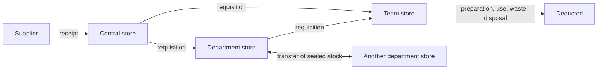
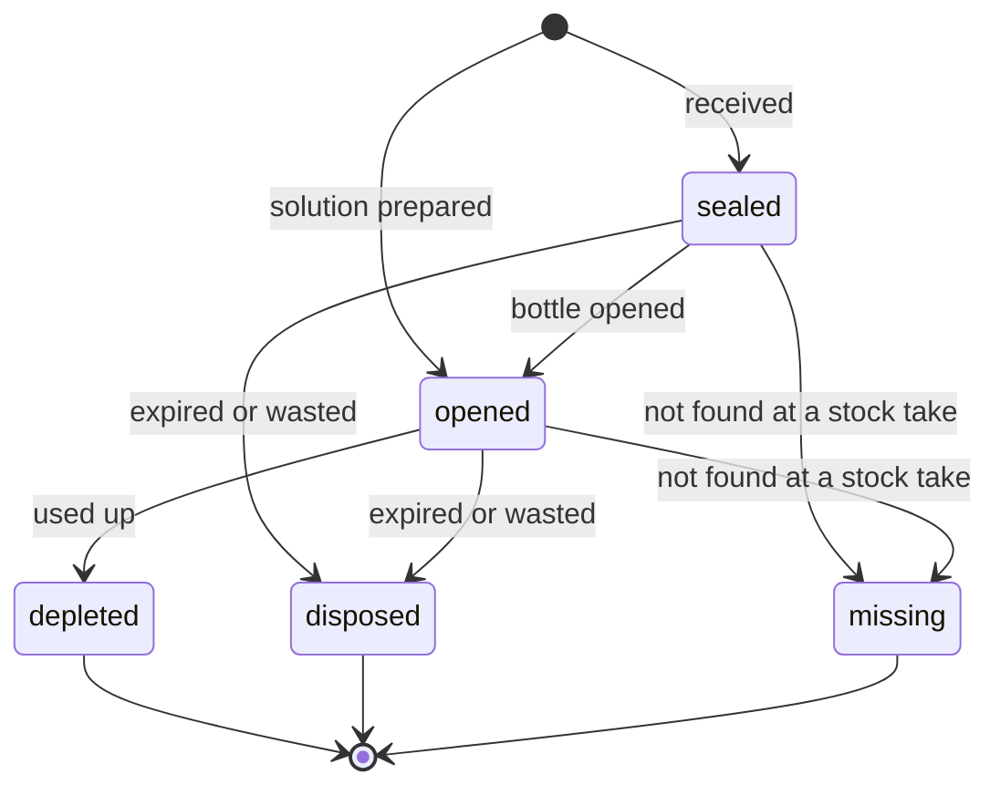

# Inventory Module Overview

The Inventory module keeps the laboratory's stock: chemicals and reagents, consumables and machine spare parts. It tracks stores and the places inside them, lots and the containers of each lot with their expiry, how stock moves between stores, what each test uses, what it costs each department and team, and buys stock from suppliers. It depends on the Laboratory module, which holds the chemicals themselves (name, CAS number, storage conditions), the testing methods, the departments and their teams. It builds on Odoo's Inventory, its stock valuation and expiry dates, and Purchase, as listed in [Module boundaries](../../business/module-boundaries.md#odoo-apps): a stock item is an Odoo product, a container is an Odoo package and a preparation is a set of Odoo stock moves. The tables are drawn in [inventory.prisma](../../infrastructure/database/inventory/inventory.prisma).

## Stock

| Rule          | Description                                                                                                                                   |
| ------------- | --------------------------------------------------------------------------------------------------------------------------------------------- |
| Items         | A stock item is a chemical or reagent, a consumable or a spare part, counted in one unit. A chemical item stocks one Laboratory chemical.        |
| Tracking      | Each item is tracked by container, by lot or by quantity. Chemicals and reagents are tracked by container. Sterile or chemically treated consumables, such as swabs, special filters and culture plates, are tracked by lot for their expiry. Basic protective equipment, such as masks and gloves, and spare parts are tracked by quantity only. |
| Lots          | Items tracked by container or lot are kept by lot, with the expiry date printed on the container and the manufacturer's certificate.          |
| Stock on hand | The quantity of each item, lot and location is kept up to date by moves.                                                                      |
| Moves         | Every change of stock is a move: a receipt, an issue to a lower store, a transfer, a preparation, a use, waste, a disposal or a stock take correction. Moves are never edited; a mistake is corrected by another move. |
| Stock takes   | Stock is checked periodically by a stock take (kiểm kê kho), done by the manager of the store. A stock take covers one location and everything inside it, with a line per item, lot, container and location: the quantity expected when it started and the quantity found. When it is done, every difference becomes a correction move, and a container that was not found is marked missing. Stock takes are scheduled as tasks at an interval the administrator sets. |

## Stores

A store is where stock is held and who is responsible for it. Whether a bottle is sealed or opened is its own status, not its store, so a department or team store can hold sealed bottles on its shelf next to opened ones.

| Rule        | Description                                                                                                                                         |
| ----------- | --------------------------------------------------------------------------------------------------------------------------------------------------- |
| Locations   | Stock is kept in a tree of locations, such as a store, a room and a fridge. A location states its storage conditions.                             |
| Stores      | Some locations are stores. The administrator sets up the stores to suit the laboratory's size: one central store for the whole laboratory, or a central store with a store for each department under it and, in a large centre, a store for each team under its department. Stores can be nested to any depth, and the locations inside a store belong to it. |
| Holder      | A store below the central store is held by a department or a team.                                                                                  |
| Manager     | Each store names the person who manages it. The central store is managed by a storekeeper; a team store is usually managed by its team lead.       |
| Visibility  | The manager of a store sees the stock of every store under it, sealed and opened, so that stock held by one department can be sent to another before more is bought. |

## Containers

Each bottle or vial of an item tracked by container, and each prepared solution, is a container with its own code and QR label, such as Lot123-01 and Lot123-02 for two bottles of lot Lot123. Opening, using and disposing of stock always names the container in hand.

| Rule                 | Description                                                                                                                                  |
| -------------------- | -------------------------------------------------------------------------------------------------------------------------------------------- |
| Container code       | Each container gets its code and QR label when it is received.                                                                               |
| Opening              | A tester opens a sealed bottle by scanning its QR code. Opening records when and by whom, and sets the bottle's usable date. The other bottles on the shelf stay sealed. |
| Usable date          | A sealed container is usable until its lot's expiry date. An opened one is usable until its opening date plus its item's shelf life after opening, usually 3 to 6 months for a chemical, or its lot's expiry date if that is earlier. |
| Prepared solution    | A prepared solution (dung dịch pha chế) is made by mixing chemicals from opened bottles with water or another solution, following a recipe, such as about 1.4 ml of 97 % sulfuric acid diluted with water to 1 litre. It starts opened. |
| Recipe               | A recipe states the chemicals and the amount of each that one preparation uses, and the shelf life of the solution, usually 1 to 2 weeks.   |
| Prepared usable date | A prepared solution is usable until its preparation date plus its recipe's shelf life, or until the first container it was made from stops being usable if that is earlier. |
| Label                | Opening a bottle or preparing a solution prints a label showing the date it was opened or prepared, the person who did it, its usable date and its QR code, on chemical-resistant labels of 2 × 1 inch or 1.5 × 1 inch. |

## Movements

| Rule           | Description                                                                                                                                    |
| -------------- | ---------------------------------------------------------------------------------------------------------------------------------------------- |
| Requisition    | A department or team requests stock from the store above it. The manager of that store approves and issues it, and the receiving side confirms receipt. A container keeps its status and usable date when it moves. |
| Transfer       | Sealed stock can move sideways between stores of the same level, arranged by the manager of the store above them. The sending side issues it and the receiving side confirms receipt. |
| Inside a store | Stock can move between the locations of one store, such as from a shelf to a fridge, without a requisition.                                   |
| No return      | Stock never moves up to a higher store, sealed or not. Sealed stock a store does not need stays on its shelf or is transferred sideways. An opened container never leaves the store it was opened in. |

## Use

| Rule          | Description                                                                                                                              |
| ------------- | ---------------------------------------------------------------------------------------------------------------------------------------- |
| Opened only   | Stock tracked by container is deducted only from opened containers.                                                                       |
| Usual use     | Each testing method states how much of each item one test uses.                                                                           |
| Automatic use | Entering a result deducts the method's usual use from the opened containers the tester scans for it, or, for an item not tracked by container, from the lot with the earliest usable date in the tester's store. The lab QA can change the container, lot and quantity. |
| Preparation   | Preparing a solution deducts its recipe's amounts from the opened bottles the tester scans.                                              |
| Waste         | Stock dropped, spilled, contaminated or wrongly prepared is deducted as waste with its reason, including loss beyond its recipe during a preparation. |
| Use by hand   | Other uses, such as calibration, cleaning or a spare part in a machine service, are recorded by hand with a reason.                      |
| Depleted      | A container whose remaining amount reaches zero, or that its user marks empty, is depleted.                                              |
| Traceability  | The moves of a result show which containers and lots it used.                                                                             |
| Expired       | A container or lot past its usable date is expired: it cannot be used and is listed for disposal. Disposing of it deducts what remained. |

## Alerts

| Rule            | Description                                                                                                         |
| --------------- | ------------------------------------------------------------------------------------------------------------------- |
| Below minimum   | When the stock of an item falls below its minimum quantity, a warning is raised and a purchase is suggested.         |
| Expiring soon   | Containers and lots whose usable date is within a number of days, a system parameter, are listed and notified.      |
| Expired         | Containers and lots that expire are marked expired by a scheduled job and notified.                                 |
| Who is warned   | The roles and departments notified of each warning are configured by the administrator ([SH-11](../shared.md#sh-11-schedules-and-reminders)); by default the storekeepers. |

## Purchasing

| Rule            | Description                                                                                                                         |
| --------------- | ----------------------------------------------------------------------------------------------------------------------------------- |
| Suppliers       | A supplier is a company contact with a code, a default contact person and the items it sells, with its own references and last prices. |
| Purchase orders | A purchase order to one supplier lists items, quantities and prices. It is signed through its approval chain before it is sent.     |
| Receipts        | Goods that arrive are received against a purchase order, or without one, into a location of the central store, with their lot, expiry, quantity, price and certificate. A done receipt creates the lots, containers and moves. |
| Received amount | A purchase order is partially received or received from the quantities its receipts brought in.                                     |

## Costs

| Rule            | Description                                                                                                                                  |
| --------------- | -------------------------------------------------------------------------------------------------------------------------------------------- |
| Unit cost       | Each lot records the purchase price of one unit, excluding VAT, from its receipt.                                                           |
| Costing method  | A [system parameter](../shared.md#sh-03-configuration-through-settings-and-system-parameters) sets how stock is costed, to match the laboratory's accounting policy: first in, first out, which costs each container at its lot's price, or moving average, which costs at the average price of the item's stock at the time. First in, first out is the default. |
| Value           | Stock on hand is valued with the costing method. Accounting entries are made in the laboratory's accounting software from the export.       |
| Cost centre     | Each department and each team is a cost centre, with a code that matches the one in the laboratory's accounting software. Stock is charged to the team or department that holds its store. |
| Charge point    | A system parameter sets when stock is charged: on issue, when it is received into a department or team store, or on use, when a bottle is opened or stock is deducted. On issue is the default. |
| Transfer charge | A transfer of stock that was already charged credits the sending cost centre and debits the receiving one.                                 |
| Prepared cost   | A prepared solution costs the amounts of the chemicals its preparation deducted, its waste included.                                        |
| Cost per test   | The cost of a sample test is the cost of what its result deducted, so the material cost of each way of testing can be reported.             |
| Reports         | Managers see the cost charged to each cost centre over a period, split by item kind and charge type.                                       |

## Budgets

| Rule       | Description                                                                                                                                     |
| ---------- | ----------------------------------------------------------------------------------------------------------------------------------------------- |
| Budget     | The administrator sets a supply budget for each cost centre for a quarter or a year. Charges to the cost centre in that period use it up.      |
| Warning    | A requisition that would take its cost centre over budget warns the requester. It is never refused for its budget, so urgent testing does not stop. |
| Escalation | A requisition over budget also needs the approval of the role the administrator sets for over-budget requisitions, such as the head of department or the centre director, before its store manager issues it. |

## Accounting export

| Rule        | Description                                                                                                                                    |
| ----------- | ---------------------------------------------------------------------------------------------------------------------------------------------- |
| Charges     | Every move that charges or credits a cost centre records its posting date, cost centre code, item code, charge type, quantity, unit cost and total value. |
| Charge types | Issue: stock requisitioned down to a department or team store. Consumption: stock used, billable when a test result used it, non-billable for use by hand. Waste: stock dropped, spilled, contaminated or wrongly prepared. Disposal: stock past its usable date. Adjustment: stock missing or found at a stock take. Transfer: sealed stock moved sideways. |
| File export | The storekeeper exports the charges of a period as CSV or Excel for the accounting software, such as MISA or FAST.                            |
| API         | The accounting software can also fetch the charges of a period through a REST API, authenticated with a key the administrator issues.         |

## Actors

- [Administrator](features/admin.md): stores, cost centre codes, recipes, budgets and the accounting API
- [Storekeeper](features/storekeeper.md): items, locations, suppliers, purchase orders, receipts, requisitions, transfers, stock takes, disposal and the accounting export
- [Team lead](features/team-lead.md): the team store and its requisitions
- [Tester](features/tester.md): opening containers, preparing solutions and recording use and waste

## Related documents

- [Overview](../index.md)
- [Module boundaries](../../business/module-boundaries.md)
- [Laboratory administrator](../laboratory_module/features/admin.md)
- [Shared technical features](../shared.md)
