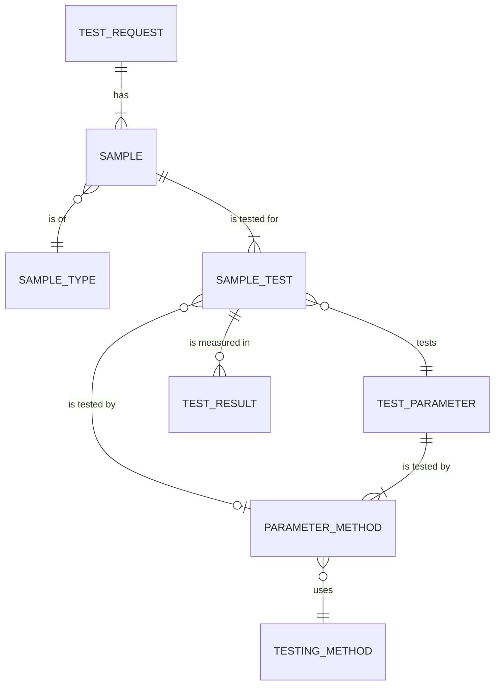
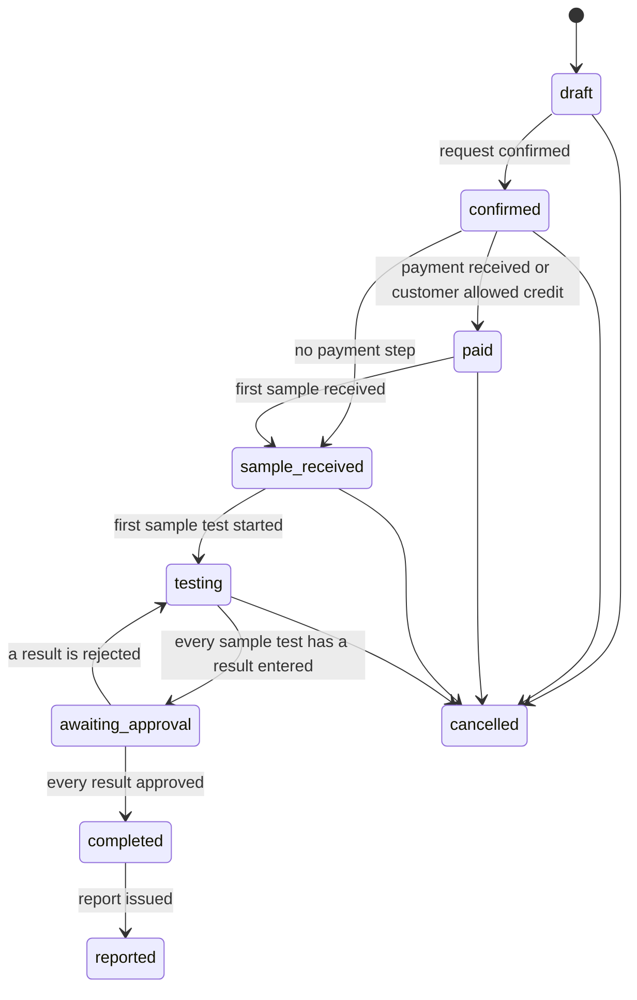
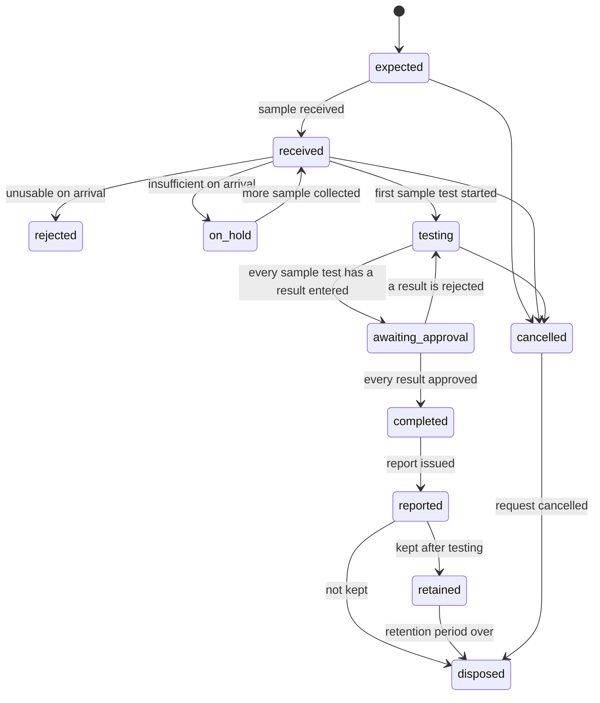
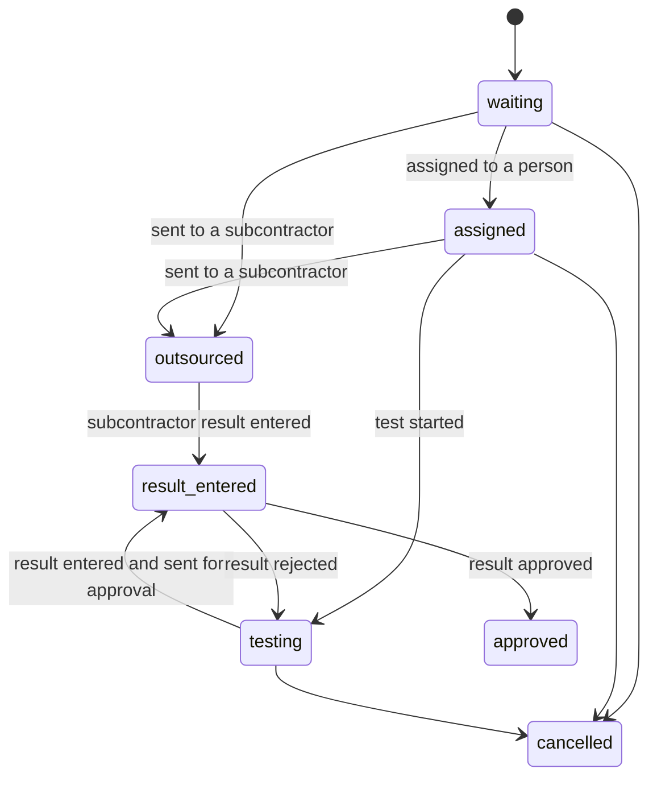
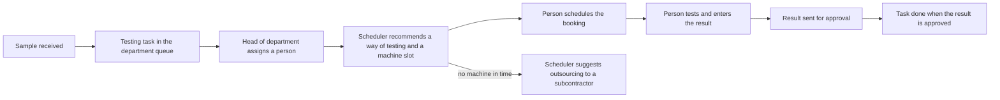

# Laboratory Module Overview

The Laboratory module is the core of MediLab. It holds the master data, the test requests, the samples and their results, and the signing that approves them. E-commerce and Inventory depend on it; it depends on no other MediLab module. It builds on Odoo's Employees, Project, Calendar, Maintenance, Discuss and units of measure, as listed in [Module boundaries](../../business/module-boundaries.md#odoo-apps). The tables are drawn in [laboratory.prisma](../../infrastructure/database/laboratory/laboratory.prisma).

## Core entities

The module is built around two entities:

- **Sample**: the material someone holds in their hand. A sample has a sample type (nền mẫu).
- **Test parameter**: what the laboratory does to the sample. A parameter belongs to parameter groups (nhóm chỉ tiêu).

A parameter has N testing methods, and a sample has N parameters.

## Test requests and samples

| Rule              | Description                                                                                                                                  |
| ----------------- | -------------------------------------------------------------------------------------------------------------------------------------------- |
| Customer          | A customer is a company or an individual. Their details are their contact; a company's people are the contact's people. A customer has a code from a sequence, the tax ID on its contact, and a citizen ID for an individual, which is masked in the audit trail. People who use the customer portal sign in with Odoo users linked to those contacts. Sales maintains customers. |
| Test request      | A test request groups the samples of one customer. E-commerce creates it from a confirmed order, with the samples sales defined on the quotation; without E-commerce, sample delivery staff create it with its samples and parameters. |
| Lab code          | Each sample gets a unique lab code (mã PTN) from a sequence. Testers see only the lab code, never the customer or the customer's name for the sample. |
| Sample details    | A sample has the customer's name for it, its sample type, its physical state (solid, liquid, gas or semi-solid), and its form and container as text. |
| Regulation        | A sample can name the regulation its results are compared with.                                                                               |
| Sample test       | Each parameter tested on a sample is a sample test, with a quantity and a due date. The way of testing is chosen later by the laboratory, helped by the scheduling system, and must be a way of testing that parameter. |

## Lifecycles

Each document keeps its own status. Tasks keep their own generic lifecycle ([SH-10](../shared.md#sh-10-tasks-and-to-do-list)).

### Test request

- The paid step comes from E-commerce. Without E-commerce, a confirmed request goes straight to sample received.

### Sample

### Sample test

## Reception

| Rule            | Description                                                                                                                          |
| --------------- | ------------------------------------------------------------------------------------------------------------------------------------ |
| Receipt         | When a sample arrives, the laboratory records when and by whom it was received, the amount received, its condition (good, damaged or insufficient) with a note, and where it is stored. |
| Label           | Each sample has a label printed by sample delivery staff, showing its lab code, its test request's code, the date results are due and a QR code of the lab code. It never shows the customer or the customer's name for the sample. |
| Photos          | Sample delivery staff attach photos of a sample when they collect or receive it, on the web or the mobile app. Photos are shown wherever the customer's name for the sample is shown, so testers never see them. |
| Handover record | When a customer hands samples over, sample delivery staff fill in a handover record (biên bản giao nhận mẫu) listing each sample with the amount and condition handed over. The customer signs it by hand on the mobile app, and the signed PDF is emailed to the customer. A signed record is never edited; a correction is a new record and the old one is kept. |
| Rejection       | A sample that cannot be tested on arrival is rejected with its condition note.                                                         |
| Insufficient    | A sample that arrives insufficient is put on hold and reported to the head of department, who asks for it to be collected again. The request schedules a sample collection task for sample delivery staff. The sample goes back to received when more sample arrives. |
| Retention       | A sample kept after testing is retained until the report date plus its sample type's retention days. |
| Disposal        | A tester disposes of a sample that is not kept, whose retention period is over, or whose request was cancelled. Disposal records when, by whom and how; the method is the one entered on the sample, or else its sample type's disposal method, and is required. Disposal cannot be undone. Every day, testers get a to-do listing the samples whose retention ends within the reminder days, a system parameter (7 by default), or has ended, and that are not disposed of yet. |
| Handover        | A received sample is handed over to each department that tests it. A person of that department records when and by whom it was received by scanning the sample's label, on the web or the mobile app; a person outside the department is refused. |

## Results

| Rule            | Description                                                                                                                       |
| --------------- | --------------------------------------------------------------------------------------------------------------------------------- |
| Attempts        | Every measurement of a sample test is its own result. Retests add a result; earlier results are kept. One result per sample test is the reported one. |
| Value           | A result is a number in the unit of the way of testing, shown with the number of decimals its way of testing sets, or a text such as "Not detected". Numbers are stored exactly, never rounded by floating point. |
| Limit copy      | When a result is created, the limit of the sample's regulation for its parameter is copied onto it with its unit. Later changes to the regulation do not change existing results. |
| Versions        | A change request on a result whose process is completed creates a new version that replaces it. The signed version stays unchanged and is marked as replaced. |
| Measurement     | A result records the machine it ran on and when it started, both taken from its booking and correctable by the lab QA; an outsourced result has no machine. The time the result is entered is when the measurement is done. |
| Entered by      | Each result records who entered it. The results of an outsourced test are entered by the subcontractor, whose people sign in to the system, or by a lab QA. |
| Conclusion      | The tester sets each result's conclusion, pass or fail, when the sample has a regulation.                                         |
| No self-approval | The person who entered a result cannot approve it; another person who signs that level must. |
| Cancelling      | The head of department can cancel a sample test of their department that has no approved result, with a reason, such as the parameter cannot be tested on the sample. Its task and bookings are cancelled. A cancelled test is left out of the report; its reason stays on the test request. |
| No deletion     | A result cannot be deleted, and neither can the sample test, sample or test request it belongs to. |

## Reports and change requests

| Rule            | Description                                                                                                                       |
| --------------- | --------------------------------------------------------------------------------------------------------------------------------- |
| Test report     | A test request has one test report (certificate of analysis, CoA) covering all its samples, issued in Vietnamese, English or both side by side. Samples have no sign-off of their own: once a sample's results are approved, the next signature is the lab head's on the report. It is signed through its approval chain and issued with a report number from a sequence and the digitally signed PDF ([SH-04](../shared.md#sh-04-signatures-and-digital-signing)). |
| Draft           | When every sample test of a request is approved or cancelled, the system creates the draft report and a signing task for the lab head. |
| Content         | The report shows its report number and the test request's code, the customer and their address, when the samples were received and the report date, and for each sample its name, lab code and conclusion with a table of parameter, result, unit, limit and method. It prints the heads of department who approved the results and the lab head; testers' signatures are internal and not printed. Cancelled tests are left out. |
| Rejection       | The lab head can reject a report with a reason, naming the results to check again. Those results go back to the queue of their head of department, unassigned and unsigned, and the report waits until they are approved again. |
| Delivery        | The test request records the report language (Vietnamese, English or bilingual, bilingual by default), how the report is delivered (in person by default, by post, by email or another way with a note) and the contact who receives it. Sample delivery staff deliver the issued report that way and record when it was delivered and by whom. Issued reports can always be downloaded from the customer portal. |
| Change request  | A change to a document whose process is completed is a change request: what to change, why, who asked and when. Anyone who can edit that type of document can raise one. It is signed through the change-request chain of the document's type ([SH-07](../shared.md#sh-07-signed-documents-are-locked)). |
| New version     | An applied change request creates a new version of the document, such as a result or a report, that replaces the old one. The old version is kept unchanged. |

## Signing

Signing follows [Approval and signing chain](../../business/approval-and-signing-chain.md) and [SH-04](../shared.md#sh-04-signatures-and-digital-signing).

| Rule            | Description                                                                                                                       |
| --------------- | --------------------------------------------------------------------------------------------------------------------------------- |
| Approval chain  | Each document type, such as test result, has one chain of levels for signing it and one for change requests on it, each signed in order. Each level names the role that signs it, whether the signer must belong to the department that did the work, and whether the level can reject. |
| Signature       | A signature records the document and its version, the level, the signer and, as they were at signing, the signer's name, role and level name. A rejection records its reason. |
| Withdrawal      | A withdrawn signature is kept with the time it was withdrawn; signature records are never deleted.                               |
| People          | A person is someone who works for the laboratory, maintained by the administrator. Their details are their contact; if they sign in, they have an Odoo user. |
| Permissions     | A permission is an action on a document type (read, create, edit, archive, delete or sign) on every record, only those of the person's department or only those of the person's team. |
| Roles           | A role is a set of permissions the administrator defines. A person holds roles and can also be given permissions directly; they have every permission of their roles plus their own. |
| Enforcement     | Permissions are enforced in the API and in the interface: a person does not see menus, records, fields or buttons for what they are not allowed to do. |
| Global rules    | Some rules hold for everyone whatever their permissions, such as a signed document not being edited, archived or deleted. See [Security](../../security/readme.md). |
| Signing levels  | Each approval level names the role that signs it. |

## Testing work and scheduling

Testing work follows [SH-10](../shared.md#sh-10-tasks-and-to-do-list) tasks and [SH-11](../shared.md#sh-11-schedules-and-reminders) schedules.

| Rule               | Description                                                                                                                                     |
| ------------------ | ----------------------------------------------------------------------------------------------------------------------------------------------- |
| Testing tasks      | When a sample is received, the system creates a testing task for each sample test and puts it in the queue of the department that does the work. |
| Assignment         | Testers claim unassigned testing tasks of their department, or the head of department assigns them: all of a sample's testing tasks in the department to one person at once, or a single task. Moving a task to another person or department needs a reason. |
| Due date           | Sales states the date the customer expects the results on the test request. Each sample test's due date is that date minus a safety margin in days, kept for handling incidents. A test is urgent when its due date is within a number of hours. The safety margin and the urgency threshold are [system parameters](../shared.md#sh-03-configuration-through-settings-and-system-parameters) administrators change. |
| Recommendation     | When a task is assigned, the scheduler recommends the way of testing and machine that can finish it soonest within its due date, from the machines that can run it and are fit to use. |
| Run time and slots | Each way of testing has a run time on each machine that can run it. A booking takes the run time rounded up to whole slots of 15 minutes.     |
| Machine queue      | Tests waiting for a machine join its queue. The scheduler gives each the next free slot: urgent tests first, then in the order they joined the queue. |
| No overlap         | The bookings of one machine do not overlap. A machine that is overdue for calibration, under repair or retired gets no bookings.              |
| Suggest outsourcing | When no machine that can run a test is available, or none has a free slot that finishes before the test's due date, the scheduler suggests outsourcing it through one of the parameter's subcontracted ways of testing. |
| Machine unavailable | When a machine becomes under repair or overdue for calibration, its scheduled bookings go back to the queue and are rescheduled on other machines; those that cannot finish in time get an outsourcing suggestion. |
| Adjusting          | The person running a test, and the head of their department, can move or cancel its booking; the slot goes back to the queue.                 |
| Bookings as tasks  | A scheduled booking appears on the person's schedule and in their to-do list as part of their testing task, due at its start.                |
| Outsourcing        | The head of department decides on outsourcing suggestions. Sample tests tested by a subcontractor are sent in a dispatch with the date sent and the date results are expected back, carried by sample delivery staff or a delivery service. |

## Actors

- [Administrator](features/admin.md): master data, people, roles, approval chains and task types
- [Sample delivery staff](features/sample-delivery-staff.md): collect, receive and hand over samples, and carry outsourced samples to subcontractors
- [Tester](features/tester.md): schedules and runs tests, enters and signs results
- [Head of department](features/head-of-department.md): assigns testing work, manages the department's schedule, approves results
- [Lab head](features/lab-head.md): signs test reports and approves their change requests
- [Subcontractor](features/subcontractor.md): sees the tests sent to it and enters their results

## Related documents

- [Overview](../index.md)
- [Administrator](features/admin.md)
- [Approval and signing chain](../../business/approval-and-signing-chain.md)
- [Shared technical features](../shared.md)
- [Database diagram](../../infrastructure/database/laboratory/laboratory.prisma)
