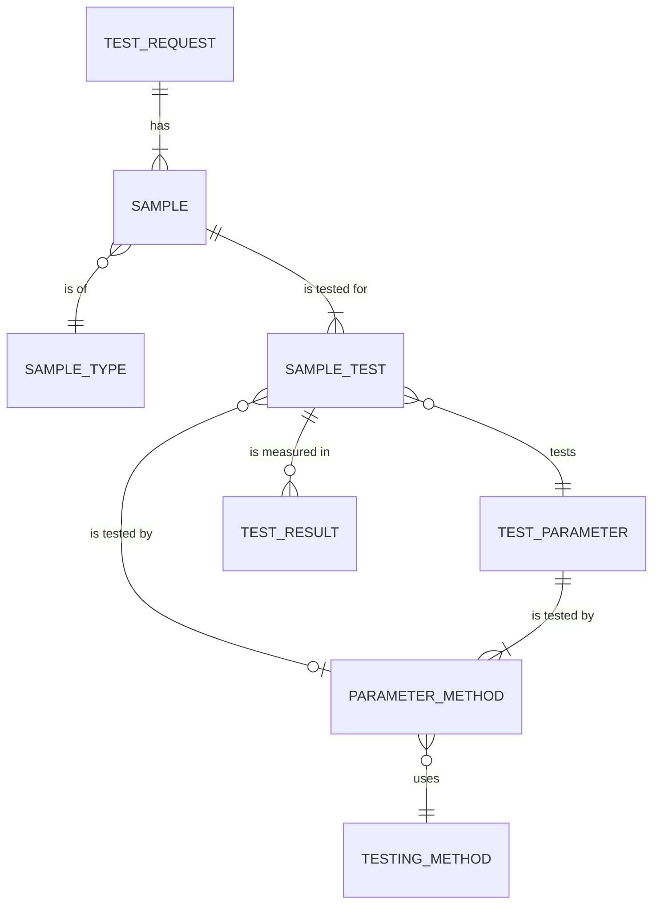

# Laboratory Module Overview

The Laboratory module is the core of MediLab. It holds the master data, the test requests, the samples and their results, and the signing that approves them. E-commerce and Inventory depend on it; it depends on no other MediLab module. The tables are drawn in [laboratory.prisma](../../infrastructure/database/laboratory/laboratory.prisma).

## Core entities

The module is built around two entities:

- **Sample**: the material someone holds in their hand. A sample has a sample type (nền mẫu).
- **Test parameter**: what the laboratory does to the sample. A parameter belongs to parameter groups (nhóm chỉ tiêu).

A parameter has N testing methods, and a sample has N parameters.

## Test requests and samples

| Rule              | Description                                                                                                                                  |
| ----------------- | -------------------------------------------------------------------------------------------------------------------------------------------- |
| Test request      | A test request groups the samples of one customer. E-commerce creates it from a confirmed order; without E-commerce the laboratory creates it. |
| Lab code          | Each sample gets a unique lab code (mã PTN) from a sequence. Testers see only the lab code, never the customer or the customer's name for the sample. |
| Sample details    | A sample has the customer's name for it, its sample type, its physical state (solid, liquid, gas or semi-solid), and its form and container as text. |
| Regulation        | A sample can name the regulation its results are compared with.                                                                               |
| Sample test       | Each parameter tested on a sample is a sample test, with a quantity. The way of testing is chosen later by the laboratory, helped by the scheduling system, and must be a way of testing that parameter. |

## Results

| Rule            | Description                                                                                                                       |
| --------------- | --------------------------------------------------------------------------------------------------------------------------------- |
| Attempts        | Every measurement of a sample test is its own result. Retests add a result; earlier results are kept. One result per sample test is the reported one. |
| Value           | A result is a number in the unit of the way of testing, or a text such as "Not detected".                                         |
| Limit copy      | When a result is created, the limit of the sample's regulation for its parameter is copied onto it with its unit. Later changes to the regulation do not change existing results. |
| Versions        | A change request on a result whose process is completed creates a new version that replaces it. The signed version stays unchanged and is marked as replaced. |
| No deletion     | A result cannot be deleted, and neither can the sample test, sample or test request it belongs to. |

## Signing

Signing follows [Approval and signing chain](../../business/approval-and-signing-chain.md) and [SH-04](../shared.md#sh-04-signatures-and-digital-signing).

| Rule            | Description                                                                                                                       |
| --------------- | --------------------------------------------------------------------------------------------------------------------------------- |
| Approval chain  | Each document type, such as test result, has one chain of levels for signing it and one for change requests on it, each signed in order. Each level names the role that signs it, whether the signer must belong to the department that did the work, and whether the level can reject. |
| Signature       | A signature records the document and its version, the level, the signer and, as they were at signing, the signer's name, role and level name. A rejection records its reason. |
| Withdrawal      | A withdrawn signature is kept with the time it was withdrawn; signature records are never deleted.                               |
| People          | Signers are people from the active people data source. The system keeps a copy of each person it has recorded, and never deletes it. |

## Actors

- [Administrator](features/admin.md)

## Related documents

- [Overview](../index.md)
- [Administrator](features/admin.md)
- [Approval and signing chain](../../business/approval-and-signing-chain.md)
- [Shared technical features](../shared.md)
- [Database diagram](../../infrastructure/database/laboratory/laboratory.prisma)
