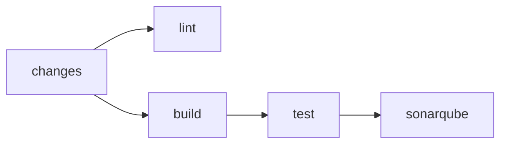

# Pipelines

What each GitHub Actions workflow in `.github/workflows/` does. How workflows are written is in [Pipelines](../conventions/pipeline.md).

## Workflows

| Workflow     | Runs on                                                       | Does                                                                                    |
| ------------ | ------------------------------------------------------------- | --------------------------------------------------------------------------------------- |
| `ci-core`    | every pull request                                            | Lints, builds and tests the Odoo modules, then runs SonarQube Cloud.                    |
| `ci-infra`   | every pull request                                            | Runs `terraform fmt`, `validate` and `plan` when `infra/` changes.                      |
| `cd-core`    | a push to `main` that changes `src/core` or the Dockerfile    | Publishes the release image.                                                            |
| `cd-infra`   | a push to `main` that changes `infra/`                        | Runs `terraform apply`.                                                                 |
| `cd-cleanup` | a closed pull request, merged or not, or a finished `cd-core` | Deletes the branch, artifacts and build caches of closed pull requests, and old images. |

Every workflow can also be started by hand.

## ci-core

- `changes` decides whether the pull request touches the core: `src/core` except Markdown, the Dockerfile, the lint action or the workflow.
- `build` builds the production image into the GitHub Actions build cache and does not push it.
- `test` builds the image again from that cache, loads it as `medilab-odoo:ci` and runs `task test:core` on it, so the tests run on the image that ships, with its Python requirements. It uploads the coverage report as the `coverage` artifact.
- `sonarqube` downloads the coverage report, scans with SonarQube Cloud and waits for the quality gate. A failed gate, including on coverage, fails the pipeline.
- A pull request from a fork cannot read secrets, so `sonarqube` fails on it with a message. Contributors push a branch to the repository instead.
- Static assets, the applications, the tests and module manifests are excluded from SonarQube coverage in `sonar-project.properties`, because no coverage report exists for them; Odoo reads manifests as data, so the tests never run their lines. Browser tests do not run in the pipeline.

## ci-infra and cd-infra

- Both read the `dev` Doppler config through the `DOPPLER_TOKEN` Actions secret; see [Secrets](secrets.md).
- Both authenticate to HCP Terraform with the `TF_API_TOKEN` Actions secret.

## Images

- `cd-core` publishes `ghcr.io/soltunemontepre/medilab`, tagged with the full commit SHA and `latest`. Deploy and roll back by the SHA tag.
- Pull request images are never pushed to a registry.
- After every `cd-core` run, `cd-cleanup` keeps the five newest tagged images and deletes the older ones and every untagged image.

## Artifacts and caches

- Artifacts are kept for one day. Image builds do not upload build records.
- `cd-cleanup` deletes the artifacts of every branch that is not `main` or an open pull request, and the build caches of every pull request that is not open. Caches from `main` are kept, so pull requests build from them.

## Branches

- `cd-cleanup` deletes the branch of a pull request when it is closed, merged or not, unless another open pull request uses it. Branches of fork pull requests are left alone.

## Related documents

- [Pipelines conventions](../conventions/pipeline.md)
- [Secrets](secrets.md)
- [Testing](../conventions/testing.md)
